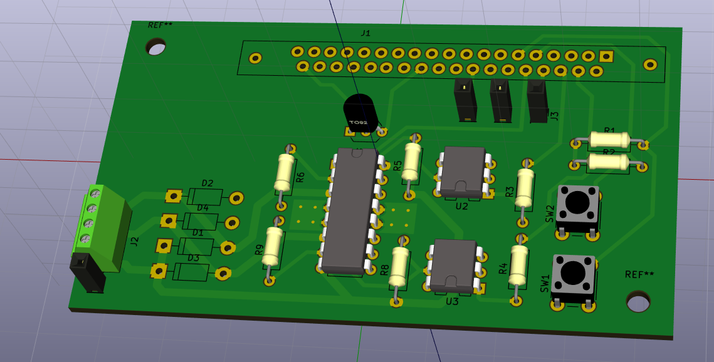

# driver_control
PCB Design for ETD555 group project

This repository includes the design files created for a motor driver circuit. 
This PCB connected to a LabJack UE-9 and was manipulated via Python code.

